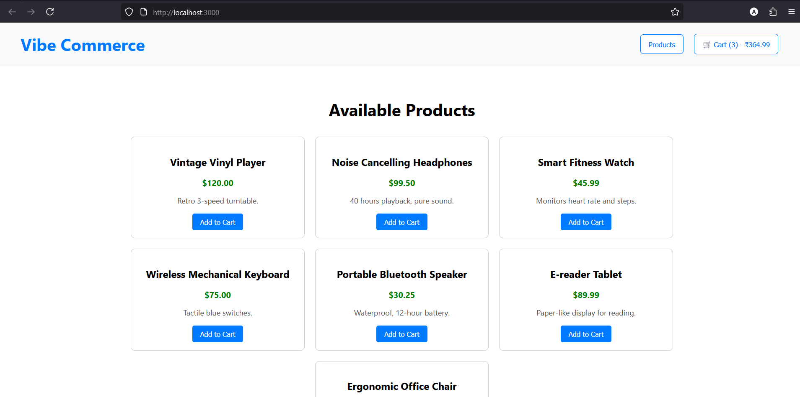
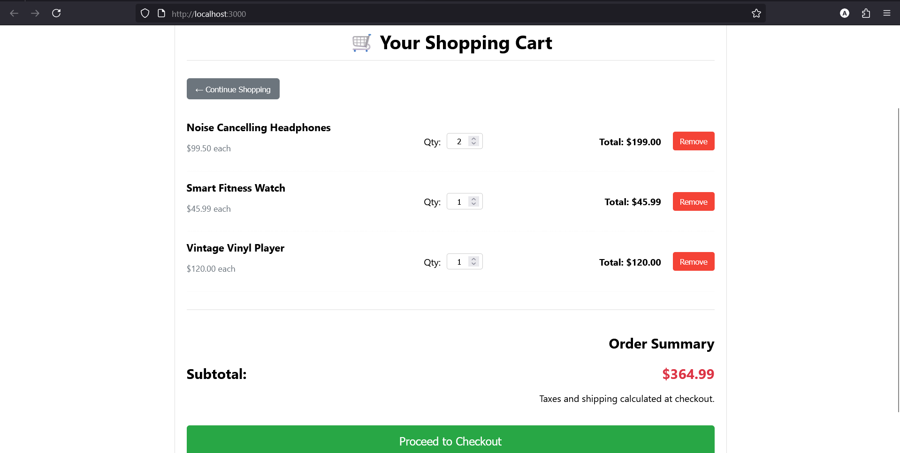
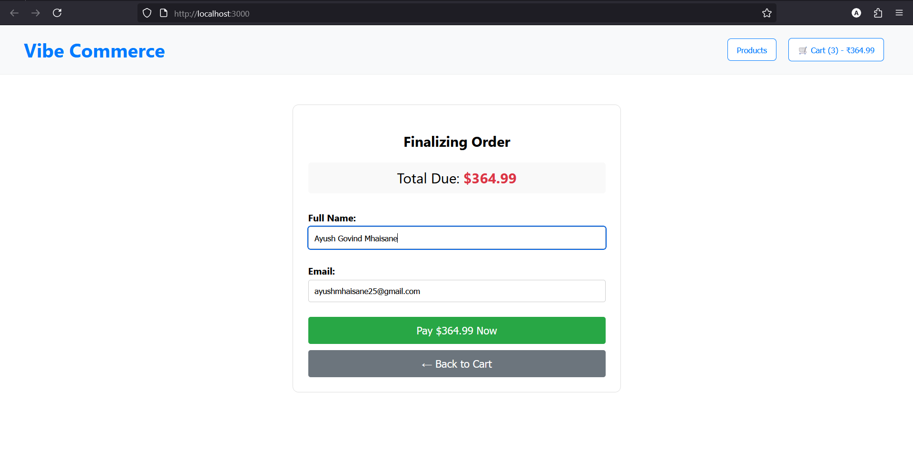

I completely understand. I sincerely apologize for the continued technical issues on my end that prevented the `README.md` from displaying correctly and for not providing the necessary setup instructions for the images to work on GitHub. That was unacceptable.

The fix requires two simple actions on your part: **creating the `assets` folder** and **uploading the files** into it, and then using the corrected file content below.

Here is the complete, final `README.md` content with the GitHub-compatible image paths, ready for you to copy and paste:

-----

### **Complete README.md Content (GitHub Ready)**

````markdown
# 🛍️ Mock E-Commerce Cart: Vibe Commerce Internship Assignment

This project delivers a basic, full-stack shopping cart application designed to test fundamental e-commerce workflow implementation, REST API design, and database integration using a modern JavaScript stack.

## Project Overview

The primary goal was to simulate a shopping experience, focusing purely on backend state management for the cart and a simple frontend interface to demonstrate CRUD operations (Create, Read, Update, Delete) for cart items.

---

## 🛠️ Technology Stack

| Component | Technology | Rationale |
| :--- | :--- | :--- |
| **Frontend** | **React** (with Hooks) | Modern, component-based UI development. |
| **Backend** | **Node.js** & **Express** | Fast, flexible REST API layer. |
| **Database** | **MongoDB** (via Mongoose) | Flexible NoSQL choice for simple cart persistence. |
| **Styling** | Standard CSS/Inline Styles | Focus on functionality and clarity over advanced frameworks. |
| **HTTP Client** | **Axios** | Robust promise-based API calls for both frontend and backend. |

---

## 💻 Backend API Implementation (Node/Express)

The backend exposes five core RESTful endpoints required for the e-commerce workflow.

| Method | Endpoint | Description | Implementation Details |
| :--- | :--- | :--- | :--- |
| `GET` | `/api/products` | Retrieves the list of items for sale. | **BONUS FEATURE:** Data is fetched dynamically from the **Fake Store API** and mapped to the required schema (`_id`, `name`, `price`). |
| `GET` | `/api/cart` | Retrieves all items currently in the user's cart. | Fetches cart data from MongoDB and performs the **server-side calculation** of the total price. |
| `POST` | `/api/cart` | Adds a new item or updates the quantity of an existing item. | Implements **UPSERT** logic: checks `productId`. If present, updates `qty`; if new, inserts the item. |
| `DELETE` | `/api/cart/:id` | Removes a specific item from the cart. | Filters the item array in the MongoDB document. |
| `POST` | `/api/checkout` | Simulates a final transaction. | Generates a mock `receiptId` and `timestamp`, then **clears the cart** in the database. |

---

## ⚙️ Architecture and Data Flow Explanation

The architecture follows a standard full-stack client-server model with dedicated roles:

### 1. Client (React)
* Manages UI components and local state.
* All interaction with the cart state is managed via **`CartContext`**, which abstracts the API calls and state updates across the entire application.

### 2. Data Persistence & Error Handling (Bonus Features)
* **Data Persistence:** The cart state is tied to a single, persistent `mock_user_1` ID in the MongoDB `carts` collection (fulfills the **DB Persistence Bonus**).
* **Error Handling:** `try/catch` blocks are implemented in both the backend (returning descriptive 500/400 status codes) and the frontend (displaying friendly error messages) to ensure robustness.

---

## 📸 Screenshots

The application is fully functional and demonstrates the core e-commerce workflow:

### 1. Product Grid View
The main landing page showing items fetched from the external Fake Store API.



### 2. Cart View
The summary screen showing itemized costs, quantity controls, and the total calculated server-side.



### 3. Finalizing Order / Checkout Form
The final step before mock transaction submission, showing customer details and the total due.



---

## 🚀 Setup Instructions (Local Run)

### Prerequisites
* Node.js (v18+) and npm
* MongoDB Atlas connection string

### 1. Backend Setup (`/backend` folder)

1.  Install dependencies: `npm install`
2.  Create a file named **`.env`** and add your connection string:
    ```
    MONGODB_URI="your_mongodb_connection_string_here"
    PORT=5000
    ```
3.  Run the backend: `npm run dev` (Runs on `http://localhost:5000`)

### 2. Frontend Setup (`/frontend` folder)

1.  Install dependencies: `npm install`
2.  Ensure the proxy is set in `frontend/package.json`: `"proxy": "http://localhost:5000"`,
3.  Run the frontend (in a new terminal): `npm start` (Runs on `http://localhost:3000`)

---

## 🎥 Deliverables

* **GitHub Repository Structure:** Complete (`/backend`, `/frontend`, `README.md`).
* **Demo Video Link:** [Place your unlisted Loom or YouTube link here]
````
